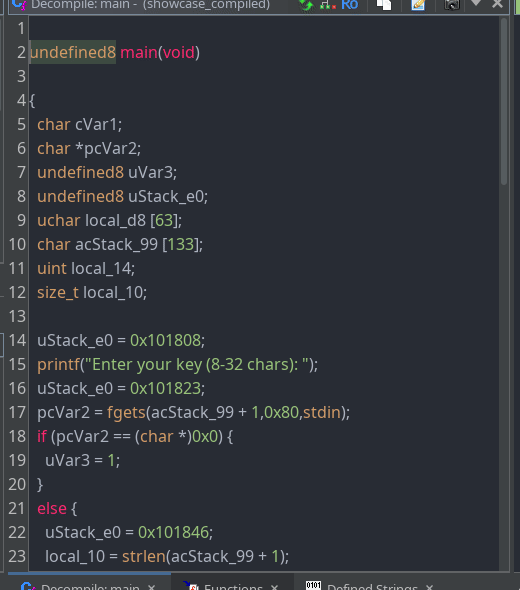
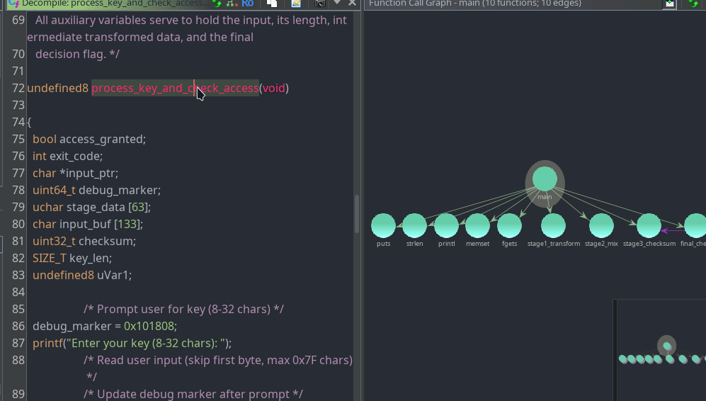

# Croqueta

<table align="center">
  <tr>
    <td>
      
    </td>
    <td>
      
    </td>
  </tr>
</table>

 

AI-powered reverse engineering assistant for Ghidra. Uses Claude, Groq, OpenAI, Gemini, or Ollama to provide intelligent suggestions for function/variable renaming, type inference, code explanations, comments, and original code style rewriting.

> [!IMPORTANT]
> **Alpha Release:** Some functionalities may not be available or fully stable. This is an early version and not a final product.

## Features

- 🤖 AI-assisted function and variable renaming
- 🔍 Type inference with validation
- 📝 Function code explanations
- 🔗 Caller context analysis
- 💬 Line-by-line comments
- 📊 Batch analysis for multiple functions
- 💻 Interactive AI chat
- ⚙️ Customizable prompts
- 🚀 Response caching

## Prerequisites

- **Ghidra** `>= 11.1.2` ([download](https://ghidra-sre.org))
- **AI API key** from:
  - [Claude](https://www.anthropic.com/api)
  - [Groq](https://console.groq.com/keys)
  - [OpenAI](https://platform.openai.com/api-keys)
  - [Gemini](https://makersuite.google.com/app/apikey)
  - Ollama (local, no key needed)

> [!NOTE]
> Written for Ghidra's Python 2.7.3 (Jython) environment.

## Installation

1. **Get Croqueta**: Clone this repository or download it from the releases page.  
2. **Add to Ghidra**:  
   - Open Ghidra and go to **Window → Script Manager**.  
   - Click **Manage Script Directories**.  
   - Add the main `Croqueta` folder.  
   - The scripts will now appear in the Script Manager—enable them by checking **In Tool**.

## Usage

### Scripts & Keybindings

- `Croqueta.py` (`SHIFT + R`): Interactive analysis
- `Croqueta_Run_All.py` (`SHIFT + A`): Quick analysis with defaults
- `Croqueta_Settings.py` (`SHIFT + S`): Configure provider/model
- `Croqueta_Batch.py` (`SHIFT + B`): Batch multiple functions
- `Croqueta_Chat.py` (`SHIFT + C`): AI chat about code
- `Croqueta_Custom_Prompt.py` (`SHIFT + P`): Edit prompts
- `Croqueta_Show_Original.py` (`SHIFT + O`): Show original-style code

### Quick Start

1. **Setup**: Run `Croqueta_Settings.py` to configure AI provider and enter API key
2. **Analyze**: Navigate to a function and run `Croqueta_Run_All.py` for complete analysis
3. **Interactive**: Use `Croqueta.py` for full control over each step

> [!IMPORTANT]
> AI assists analysis—always verify suggestions manually.

## Configuration

Edit `croqueta/config.py` to customize:

- `DEFAULT_PROVIDER`: Default AI provider ("Groq")
- `DEFAULT_MODEL`: Default model ("openai/gpt-oss-120b")
- `DEFAULT_ACTIONS`: Actions to run (rename/retype, explanation, line_comments)
- `SKIP_PROMPT_CONFIRMATION`: Skip prompt review (False)
- `ENABLE_CACHING`: Cache responses (True)
- `THEME`: UI theme ("light" or "dark")

## License

GNU General Public License v3.0 - see LICENSE file.

## Testing & Contributing

> [!NOTE]
> I only tested the Groq API since it's free and my computer isn't powerful enough for local models. Please test other providers (Claude, OpenAI, Gemini, Ollama) and report any issues!

Contributions are welcome! Please feel free to submit a Pull Request. Test different AI providers, improve the code, or add new features. Your participation helps make Croqueta better for everyone.
